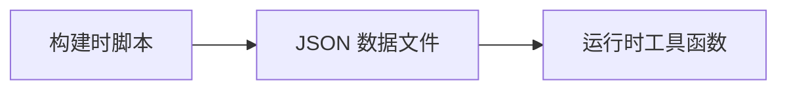

一份完整的 astro-koharu 博客系统使用指南，帮助你快速上手并充分利用所有功能特性。

https://github.com/cosZone/astro-koharu

## 快速开始

### 项目简介

astro-koharu 是一个基于 Astro 5.x 构建的现代化博客系统，从 Hexo 迁移而来，设计灵感和初衷都来自 [Shoka](https://github.com/amehime/hexo-theme-shoka) 主题。欢迎 [fork](https://github.com/cosZone/astro-koharu/fork) 出来制作自己的主题。

**核心特点：**

- 基于 Astro 5.x，静态站点生成，性能优异
- 优雅的深色/浅色主题切换
- 基于 Pagefind 的无后端全站搜索
- 完整的 Markdown 增强功能（GFM、代码高亮、自动目录）
- 灵活的多级分类与标签系统（从 Shoka 主题迁移，后续会考虑将其改为可关闭的）
- 多系列文章支持（周刊、书摘等自定义系列，支持自定义 URL slug）
- 响应式设计
- 草稿与置顶功能
- 阅读进度条与阅读时间估算
- 移动端文章阅读头部
- 友链系统与归档页面
- RSS 订阅支持
- LQIP（低质量图片占位符）
- 圣诞特辑（可开关）

### 本地开发

```bash
# 克隆项目
git clone https://github.com/cosZone/astro-koharu.git
cd astro-koharu

# 安装依赖
pnpm install

# 启动开发服务器
pnpm dev

# 构建生产版本
pnpm build

# 预览生产构建
pnpm preview
```

### 快速部署

使用 Vercel 进行一键部署：

[](https://vercel.com/new/clone?repository-url=https://github.com/cosZone/astro-koharu&project-name=astro-koharu&repository-name=astro-koharu)

## 基本配置

### 站点配置

编辑 `config/site.yaml` 文件配置站点基本信息：

```yaml
# =============================================================================
# 站点基础信息
# =============================================================================
site:
  title: 余弦の博客 # 网站标题
  alternate: cosine # 英文短名（用作 logo 文本）
  subtitle: WA 的一声就哭了 # 副标题
  name: cos # 站点作者简称
  description: FE / ACG / 手工 / 深色模式强迫症 / INFP # 站点简介
  avatar: /img/avatar.webp # 头像路径
  showLogo: true # 是否显示 logo
  author: cos # 文章作者
  url: https://blog.cosine.ren/ # 站点域名
  startYear: 2020 # 站点创建年份
  keywords: # SEO 关键词
    - cos
    - cosine
    - 博客
    - 技术
    - 前端
```

### 本地轻 CMS 应用

本项目提供独立的 CMS 管理应用，支持文章管理、浏览器内编辑、Markdown 预览等功能。


**启动 CMS：**

```bash
# 首次使用需安装依赖
pnpm cms:install

# 启动 CMS（默认端口 4322）
pnpm cms
```

CMS 提供以下功能：

- 📊 文章仪表盘：查看文章统计、分类分布、最近更新
- 📝 浏览器内编辑器：基于 BlockNote 的富文本编辑，支持 Markdown
- 🔄 草稿/发布切换：一键切换文章状态
- 📌 置顶管理：快速置顶/取消置顶文章
- ➕ 新建文章：交互式创建文章，自动生成 frontmatter

### 本地编辑器跳转

文章页的编辑按钮支持一键跳转到本地编辑器（VS Code / Cursor / Zed 等）。

**配置文件：** `config/site.yaml` 的 `dev` 部分

```yaml
dev:
  localProjectPath: "/Users/yourname/path/to/astro-koharu" # 本地项目绝对路径
  contentRelativePath: "src/content/blog" # 博客内容目录
  editors:
    - id: vscode
      name: VS Code
      icon: devicon-plain:vscode # 可从 https://icon-sets.iconify.design/ 搜寻图标
      urlTemplate: "vscode://file{path}"
    - id: cursor
      name: Cursor
      icon: simple-icons:cursor
      urlTemplate: "cursor://file{path}"
    - id: zed
      name: Zed
      icon: simple-icons:zedindustries
      urlTemplate: "zed://file{path}"
```

**配置说明：**

- `localProjectPath` 必须是本机的绝对路径，否则无法生成正确的文件路径
- `urlTemplate` 支持 `{path}` 占位符，会被替换为文件的完整路径
- 配置后，文章页会显示编辑按钮，点击可直接在本地编辑器中打开文件

**特色分类配置：**

在首页底部展示的精选分类卡片：

```yaml
featuredCategories:
  - link: life # 分类链接（对应 category_map）
    label: 随笔 # 显示名称
    image: /img/cover/2.webp # 封面图片
    description: 生活记录、年度总结等 # 描述
  - link: note/front-end
    label: 前端笔记
    image: /img/cover/1.webp
    description: 前端相关的笔记
  # ... 更多分类
```

**多系列文章配置：**

配置特色系列（如周刊、书摘等），支持多个系列，每个系列拥有独立页面和自定义 URL：

```yaml
featuredSeries:
  - slug: weekly # URL 路径: /weekly（必填，作为页面路由）
    categoryName: 周刊 # 分类名称（用于匹配文章）
    label: FE Bits # 显示标签
    fullName: FE Bits 前端周周谈 # 完整名称
    description: | # 描述（支持多行）
      之前在自己的频道进行一些输出，于是有了这个周刊！
      更新时间期望是在每周天
    cover: /img/weekly_header.webp # 封面图
    enabled: true # 是否启用
    icon: ri:newspaper-line # 导航图标（可选）
    highlightOnHome: true # 是否在首页高亮最新文章（可选，默认 true）
    links: # 相关链接
      github: https://github.com/your-username/your-repo
      rss: /rss.xml

  - slug: reading # URL 路径: /reading
    categoryName: 书摘
    label: 读书笔记
    fullName: 我的读书笔记
    description: 读书摘录与感悟
    cover: /img/reading_header.webp
    enabled: true
    highlightOnHome: false # 此系列不在首页高亮
```

**字段说明：**

| 字段              | 必填 | 说明                                 |
| ----------------- | ---- | ------------------------------------ |
| `slug`            | ✅   | URL 路径，如 `weekly` 对应 `/weekly` |
| `categoryName`    | ✅   | 分类名称，用于匹配文章               |
| `label`           | ❌   | 显示标签（默认使用 categoryName）    |
| `enabled`         | ❌   | 是否启用此系列（默认 true）          |
| `fullName`        | ❌   | 完整名称（用于页面标题）             |
| `description`     | ❌   | 系列描述                             |
| `cover`           | ❌   | 封面图片路径                         |
| `icon`            | ❌   | 导航图标（Iconify 格式）             |
| `highlightOnHome` | ❌   | 是否在首页高亮最新文章（默认 true）  |
| `links`           | ❌   | 相关链接（github、rss 等）           |

### 社交媒体配置

在 `config/site.yaml` 中配置社交媒体链接：

```yaml
social:
  github:
    url: https://github.com/your-username
    icon: ri:github-fill # Iconify 图标名
    color: "#191717" # 主题色
  bilibili:
    url: https://space.bilibili.com/your-uid
    icon: ri:bilibili-fill
    color: "#da708a"
  email:
    url: mailto:your@email.com
    icon: ri:mail-line
    color: "#55acd5"
  rss:
    url: /rss.xml
    icon: ri:rss-line
    color: "#ff6600"
  # ... 更多平台
```

支持的平台：GitHub, Twitter, Bilibili, 网易云音乐, Email, RSS 等。完整配置请参考 `config/site.yaml` 文件。

### 导航配置

在 `config/site.yaml` 中自定义导航菜单：

```yaml
navigation:
  - name: 首页
    path: /
    icon: fa6-solid:house-chimney
  - name: 周刊
    path: /weekly # 对应 featuredSeries 中 slug: weekly 的系列
    icon: ri:newspaper-line
  - name: 读书笔记
    path: /reading # 对应 featuredSeries 中 slug: reading 的系列
    icon: ri:book-open-line
  - name: 文章
    icon: ri:quill-pen-ai-fill
    children: # 支持嵌套子菜单
      - name: 分类
        path: /categories
        icon: ri:grid-fill
      - name: 标签
        path: /tags
        icon: fa6-solid:tags
      - name: 归档
        path: /archives
        icon: ri:archive-2-fill
  - name: 友链
    path: /friends
    icon: ri:links-line
  - name: 关于
    path: /about
    icon: fa6-regular:circle-user
```

> **注意**：系列页面的路径格式为 `/{slug}`，需要与 `featuredSeries` 中配置的 `slug` 字段一致。

### 分类映射配置

在 `config/site.yaml` 中配置中文分类名到 URL slug 的映射：

```yaml
# =============================================================================
# Category Map
# Maps Chinese category names to URL-friendly English slugs
# =============================================================================
categoryMap:
  # Primary categories
  随笔: life
  笔记: note
  工具: tools
  周刊: weekly # 用于分类页面 /categories/weekly
  书摘: reading # 用于分类页面 /categories/reading
  # Secondary categories (for nested paths)
  前端: front-end
  # Add more as needed:
  # 后端: back-end
  # 算法: algorithm
```

这样，"随笔" 分类的 URL 会是 `/categories/life`，而不是 `/categories/随笔`。

> **注意**：`categoryMap` 仅用于分类页面（`/categories/*`）的 URL 映射。系列页面的 URL（如 `/weekly`、`/reading`）由 `featuredSeries` 中的 `slug` 字段单独配置。

## 文章系统

### 创建文章

**方式一：使用 Koharu CLI（推荐）**

使用交互式 CLI 工具快速创建文章：

```bash
pnpm koharu new post
```

CLI 工具会引导你输入标题、分类、标签等信息，自动生成 frontmatter 和 markdown 文件。

**方式二：手动创建**

在 `src/content/blog/` 目录下创建 Markdown 文件。目录结构会影响文章的分类：

```plain
src/content/blog/
├── life/              # 随笔分类
│   └── 2024-life-review.md
├── note/
│   ├── front-end/     # 笔记 > 前端
│   │   └── react/
│   │       └── React学习小记.md
│   └── algorithm/     # 笔记 > 算法
│       └── 动态规划学习笔记.md
└── tools/             # 工具分类
    └── vscode插件推荐.md
```

### Frontmatter 字段说明

每篇文章开头需要包含 YAML frontmatter：

**必填字段：**

```yaml
---
title: 文章标题 # 必填
date: 2024-12-06 # 必填，发布日期
---
```

**常用可选字段：**

```yaml
---
title: 文章标题
date: 2024-12-06
updated: 2024-12-15 # 最近更新时间（可选，存在时会在文章页显示）
description: 文章摘要描述 # 用于 SEO 和列表展示，如不填写会自动使用 AI 摘要或提取正文前 150 字
link: custom-url-slug # 自定义 URL（默认使用文件名）
cover: /img/cover/1.webp # 封面图片
tags: # 标签列表
  - JavaScript
  - React
categories: # 分类（见下方详细说明）
  - 笔记
subtitle: 副标题 # 文章副标题
catalog: true # 是否显示目录（默认 true）
tocNumbering: true # 是否显示目录编号（默认 true）
draft: false # 是否为草稿（默认 false）
sticky: false # 是否置顶（默认 false）
excludeFromSummary: false # 是否排除 AI 摘要和相似度计算（默认 false，系列文章建议设为 true）
math: false # 是否启用数学公式渲染（默认 false，启用后支持 KaTeX）
quiz: false # 是否启用练习题交互（默认 false，启用后支持四种题型）
---
```

**关于 description 字段：**

文章描述的优先级：手写 `description` > AI 自动摘要 > Markdown 正文前 150 字

- 建议为重要文章手写描述，以获得更好的 SEO 效果
- 如果省略描述，系统会自动使用 AI 生成的摘要（需运行 `pnpm generate:summaries`）
- 如果既没有手写描述也没有 AI 摘要，则自动提取文章正文的前 150 个字符

**关于 link 字段（自定义 URL）：**

⚠️ **重要**：`link` 字段会被**自动转换为小写**，以保持 URL 的一致性和规范性。

- **规范化行为**：无论你输入 `MyPost`、`myPost` 还是 `mypost`，最终 URL 都会是 `/post/mypost`
- **文件名大小写无关**：文章文件名可以使用任意大小写（如 `MyPost.md`），系统会自动处理
- **AI 摘要和相似度**：生成的 `summaries.json` 和 `similarities.json` 中的 key 也会统一为小写
- **最佳实践**：建议直接使用小写和连字符（如 `my-awesome-post`），避免混淆

```yaml
# ✅ 推荐写法
link: my-awesome-post  # URL: /post/my-awesome-post

# ⚠️ 会被转为小写
link: MyAwesomePost    # URL: /post/myawesomepost（不是 /post/MyAwesomePost）
link: My-Awesome-Post  # URL: /post/my-awesome-post
```

如果省略 `link` 字段，系统会使用文件名（同样会转为小写）：

```yaml
# 文件: src/content/blog/MyPost.md
# 省略 link 字段 → URL: /post/mypost
```

### 分类系统

astro-koharu 支持灵活的分类配置：

**单层分类：**

```yaml
categories:
  - 工具 # 或者 ['工具']
```

对应 URL: `/categories/tools`（根据 `categoryMap` 映射）

**多层嵌套分类：**

```yaml
categories:
  - [笔记, 前端, React]
```

这会创建层级关系：笔记 → 前端 → React

对应 URL: `/categories/note/front-end/react`

### 标签系统

标签是扁平的，不支持层级：

```yaml
tags:
  - JavaScript
  - TypeScript
  - 学习笔记
```

所有标签会在 `/tags` 页面展示，点击标签可查看该标签下的所有文章。

### 草稿功能

设置 `draft: true` 将文章标记为草稿：

```yaml
---
title: 未完成的文章
draft: true
---
```

**行为：**

- **本地开发** (`pnpm dev`)：草稿可见，文章卡片右上角显示 "DRAFT" 标识
- **生产构建** (`pnpm build`)：草稿自动过滤，不会出现在任何列表中

### 置顶功能

设置 `sticky: true` 将文章置顶：

```yaml
---
title: 重要公告
sticky: true
---
```

**行为：**

- 置顶文章显示在首页 "置顶文章" 区域
- 置顶文章按日期排序（最新的在前）
- 不影响其他页面（分类、标签、归档）的排序

### 系列文章

配置了 `featuredSeries` 的系列（见基本配置），其分类下的文章会：

1. 拥有专属的系列页面（URL 由 `slug` 决定，如 `/weekly`、`/reading`）
2. 不出现在普通文章列表（`/posts`）中
3. 如果系列设置了 `highlightOnHome: true`，最新一篇会在首页高亮显示

**示例：**

```yaml
---
title: FE Bits Vol.16
categories:
  - 周刊 # 对应某个 featuredSeries 的 categoryName
excludeFromSummary: true # 可选：排除 AI 摘要生成
---
```

```yaml
---
title: 《代码大全》读书笔记
categories:
  - 书摘 # 对应另一个 featuredSeries 的 categoryName
---
```

> **提示**：文章的 `categories` 字段需要与 `featuredSeries` 中某个系列的 `categoryName` 匹配才会被归入该系列。

### 独立页面

除了博客文章外，你可以在 `src/pages/` 目录下创建 `.md` 文件来添加独立页面（如"关于"、"歌单"等）。这些页面使用 `PageLayout.astro` 布局，支持完整的 Markdown 增强语法。

**创建独立页面：**

在 `src/pages/` 目录下新建 `.md` 文件：

```markdown
---
layout: ../layouts/PageLayout.astro
title: "歌单"
description: "我喜欢的音乐"
coverTitle: "我的歌单"
comments: false
---

页面内容...
```

**Frontmatter 字段：**

| 字段          | 必填 | 说明                                          |
| ------------- | ---- | --------------------------------------------- |
| `layout`      | ✅   | 固定为 `../layouts/PageLayout.astro`          |
| `title`       | ✅   | 页面标题（用于浏览器标签页）                  |
| `description` | ❌   | 页面描述（用于 SEO）                          |
| `coverTitle`  | ❌   | 封面显示的标题（默认使用 `title`）            |
| `comments`    | ❌   | 是否显示评论区（默认 `true`）                 |

**添加导航入口：**

在 `config/site.yaml` 的 `navigation` 中添加对应菜单项：

```yaml
navigation:
  # ...
  - name: 歌单
    path: /music
    icon: ri:music-2-fill
```

> **提示**：`src/pages/` 下所有 `.md` 文件会被 Koharu CLI 的备份功能自动覆盖，无需额外配置。

## 界面功能

### 主题切换

点击右上角的太阳/月亮图标切换深色/浅色模式。

**代码高亮：**

- 浅色模式：`github-light`
- 深色模式：`github-dark`

### 全站搜索

基于 [Pagefind](https://pagefind.app/) 的静态站点搜索，无需后端服务器。

**打开搜索：**

- 点击导航栏搜索图标
- 快捷键：`Cmd/Ctrl + K`

**特性：**

- 支持中文分词
- 实时搜索结果
- 高亮匹配关键词
- 显示文章摘要和元信息

### 文章阅读功能

**目录导航 (Table of Contents)：**

- 自动提取文章标题（h2-h6）生成目录
- 使用 CSS 计数器自动为标题添加层级编号（如 1., 1.1., 1.1.1.）
- 支持通过 frontmatter 的 `tocNumbering: false` 字段关闭编号显示
- 点击目录项跳转到对应章节
- 滚动时自动高亮当前章节
- 桌面端显示在右侧边栏，移动端折叠

**目录编号控制：**

```yaml
---
title: 我的文章
tocNumbering: false # 关闭目录编号（默认为 true）
---
```

- 默认情况下，所有文章的目录都会显示层级编号
- 设置 `tocNumbering: false` 可以关闭特定文章的编号显示
- 编号通过 CSS 计数器实现，零运行时开销
- 同时适用于桌面端侧边栏和移动端下拉目录

**阅读进度条：**

- 页面顶部显示阅读进度
- 实时更新当前阅读位置

**标题锚点链接：**

- 每个标题自动生成 ID
- 悬停标题时显示 `#` 链接图标
- 点击可复制带锚点的 URL

**系列文章导航：**

文章底部显示同系列的上一篇/下一篇：

- 基于最深层分类自动分组
- 按发布日期排序
- 显示文章标题和封面

**阅读时间估算：**

文章卡片显示预计阅读时间（基于字数计算）。

**移动端文章阅读头部：**

在移动端（≤992px）浏览文章时，顶部导航栏会显示专为阅读优化的头部：

- **圆形阅读进度** - 实时显示当前阅读进度的圆形进度条
- **当前章节标题** - 显示当前所在的 H2/H3 章节标题，切换时带有平滑动画
- **可展开目录** - 点击标题区域可展开完整的文章目录，快速跳转到任意章节

特性：

- 滚动时自动更新当前章节
- 支持 `prefers-reduced-motion` 减少动画

### 响应式设计

**桌面端：**

- 双栏布局（主内容 + 侧边栏）
- 固定导航栏
- 悬浮目录

**平板：**

- 自适应布局调整
- 简化侧边栏

**移动端：**

- 单栏布局
- 抽屉式导航菜单（汉堡菜单）
- 折叠式目录
- 触摸优化的交互
- 文章页专属阅读头部（进度圈 + 当前标题 + 可展开目录）

## 特色功能

### 系列文章系统

`featuredSeries` 支持配置多个系列，每个系列会自动生成独立页面：

**专属系列页面** (`/{slug}`)：

- 每个启用的系列都有独立页面（如 `/weekly`、`/reading`）
- 显示该系列的所有文章
- 系列头图和介绍
- 相关链接（GitHub, RSS 等）

**首页展示：**

- 设置 `highlightOnHome: true` 的系列，其最新文章会在首页高亮显示
- 设置 `highlightOnHome: false` 的系列不在首页展示
- 所有系列文章独立于普通文章列表

> 💡 **设计说明：分离关注点**
>
> featuredSeries 的设计初衷是**将高产出分类从首页分离**，避免首页被单一类型文章刷屏。适用场景：
>
> - **周刊/日记**：更新频繁，数量庞大
> - **读书笔记/书摘**：独立成系列，方便按系列浏览
> - **任何文章数量较多的分类**：当某分类文章数量远超其他分类时
>
> **首页行为**：
>
> - 系列文章从首页主列表排除
> - 设置 `highlightOnHome: true` 时，最新一篇在首页顶部高亮
> - 其余文章通过系列专属页面（如 `/weekly`）访问
>
> **其他页面正常展示**：系列文章在归档、分类、标签、搜索等页面仍与普通文章一起显示，仅首页主列表做了分离。

**配置示例：**

```yaml
featuredSeries:
  - slug: weekly
    categoryName: 周刊
    highlightOnHome: true # 首页展示最新周刊
    # ...
  - slug: reading
    categoryName: 书摘
    highlightOnHome: false # 不在首页展示
    # ...
```

### 归档页面

访问 `/archives` 查看所有文章的归档视图：

- 按年份分组
- 显示每年的文章数量
- 时间线式展示
- 包含文章发布日期、标题、分类

### 友链系统

访问 `/friends` 查看友情链接页面：

**功能：**

- 友链卡片展示
- 友链申请表单（可自定义）
- 支持头像、名称、描述、链接

### LQIP（低质量图片占位符）

LQIP（Low Quality Image Placeholder）是一种图片加载优化技术，在高清图片加载完成前，先显示一个低质量的占位符，避免页面出现空白或布局抖动。

**特性：**

- 🎨 构建时自动提取图片主色调，生成 CSS 渐变占位符
- ⚡ 零运行时开销 —— 纯 CSS 实现，无需 JavaScript 解码
- 📦 极小数据体积 —— 每张图片仅需 18 字符存储
- 🔄 外部图片自动降级为纯色占位符

**支持的组件：**

- 文章卡片封面 (`PostItemCard`)
- 页面横幅 (`Cover`)
- 分类卡片背景 (`CategoryCards`)
- 系列封面 (`SeriesCover`)
- 侧边栏头像 (`HomeInfo`)

**使用方式：**

```bash
# 生成 LQIP 数据（处理 public/img/ 下所有图片）
pnpm generate:lqips
```

**生成效果：**

LQIP 数据保存在 `src/assets/lqips.json`，格式如下：

```json
{
  "cover/1.webp": "87a3c4c2dfefbddae9",
  "cover/2.webp": "6e3b38ae7472af7574"
}
```

每个值是 18 个十六进制字符（3 个颜色），运行时解码为 CSS 渐变：

```css
linear-gradient(135deg, #87a3c4 0%, #c2dfef 50%, #bddae9 100%)
```

**原理：**

1. 使用 sharp 将图片缩放到 2×2 像素
2. 提取四象限的平均色（左上、右上、左下、右下）
3. 选取 3 个颜色生成 135 度斜向渐变
4. 存储为紧凑的十六进制字符串

**在组件中使用：**

```astro
---
import { getLqipStyle, getLqipProps } from '@lib/lqip';

// 方式 1：直接获取样式字符串
const style = getLqipStyle('/img/cover/1.webp');
// 返回: "background-image:linear-gradient(...)"

// 方式 2：获取完整的 props（支持外部图片降级）
const lqipProps = getLqipProps(coverUrl);
// 本地图片返回: { style: "background-image:..." }
// 外部图片返回: { class: "lqip-fallback" }
---

<div style={style}>
  
</div>
```

**注意事项：**

- 生成的 `src/assets/lqips.json` 需要提交到 git
- 添加新图片后需要重新运行 `pnpm generate:lqips`
- 外部图片（http/https 开头）会自动使用纯色占位符降级

### 相关文章推荐

参考 [No Server, No Database: Smarter Related Posts in Astro with `transformers.js`](https://alexop.dev/posts/semantic-related-posts-astro-transformersjs/)

基于语义相似度的智能文章推荐系统，使用 [transformers.js](https://huggingface.co/docs/transformers.js) 在本地生成文章嵌入向量，计算文章间的语义相似度。

**特性：**

- 🧠 基于 AI 嵌入模型（Snowflake Arctic Embed）的语义理解
- 📊 自动计算文章间的相似度，推荐最相关的 5 篇文章
- 🚀 构建时预计算，运行时零开销
- 🔧 支持通过 frontmatter 排除特定文章

**使用方式：**

```bash
# 生成相似度数据（本地运行，会自动下载模型，约需 3-5 分钟）
pnpm generate:similarities

# 生成的文件会提交到 git，Vercel 等平台直接使用
```

**排除特定文章：**

在文章 frontmatter 中设置 `excludeFromSummary: true` 可排除该文章：

```yaml
---
title: 周刊第 1 期
excludeFromSummary: true # 排除此文章的相似度计算和 AI 摘要生成
---
```

> **提示**：系列文章（如周刊）通常建议设置 `excludeFromSummary: true`，避免影响其他文章的推荐质量。

**配置计算内容：**

可以选择是否将文章正文纳入相似度计算：

```typescript
// true: 使用 标题 + 描述 + 正文（更准确，速度较慢）
// false: 仅使用 标题 + 描述（更快，适合文章数量较多的情况）
const INCLUDE_BODY = true;
```

- **包含正文**：相似度更精确，能识别内容层面的相关性，但生成速度较慢
- **仅标题+描述**：生成速度快，适合描述写得比较详细的博客

```bash
# 使用 Snowflake/snowflake-arctic-embed-m-v2.0 计算 168 篇文章（标题+描述）的时间
Done! Generated similarities for 168 posts in 4.1s

# 使用 Snowflake/snowflake-arctic-embed-m-v2.0 计算 168 篇文章（标题+描述+正文）的时间
Done! Generated similarities for 168 posts in 219.3s
```

这差别有点大，但是我个人很喜欢带正文的结果，效果显然会更好。所以索性再加一个跑 AI 总结的功能。

**模型选择：**

默认使用 `Snowflake/snowflake-arctic-embed-m-v2.0` 模型：

- **模型大小**：约 90MB（首次运行会自动下载到 `.cache/transformers` 目录）
- **向量维度**：768 维
- **性能**：平衡了质量和速度，适合中文和英文内容
- **生成时间**：约 3-5 分钟（169 篇文章）

如需更换模型，编辑 `src/scripts/generateSimilarities.ts` 中的 `MODEL_NAME`：

```typescript
const MODEL_NAME = "Snowflake/snowflake-arctic-embed-m-v2.0";
// 可选替代方案：
// const MODEL_NAME = 'sentence-transformers/all-MiniLM-L6-v2'; // 更小更快（约 23MB），384 维
// const MODEL_NAME = 'BAAI/bge-small-zh-v1.5';  // 针对中文优化
```

**其他可选模型对比：**

| 模型                                      | 大小  | 维度 | 优势               |
| ----------------------------------------- | ----- | ---- | ------------------ |
| `Snowflake/snowflake-arctic-embed-m-v2.0` | ~90MB | 768  | 质量高，中英文均衡 |
| `sentence-transformers/all-MiniLM-L6-v2`  | ~23MB | 384  | 轻量快速           |
| `BAAI/bge-small-zh-v1.5`                  | ~95MB | 512  | 中文专用           |

**注意事项：**

- 需要本地运行生成脚本（Vercel 等平台无法运行模型）
- 生成的 `src/assets/similarities.json` 需要提交到 git
- 如果没有生成相似度文件，相关文章模块不会显示
- 模型文件会缓存在 `.cache/transformers` 目录（已添加到 `.gitignore`）

### AI 自动摘要

基于 [transformers.js](https://huggingface.co/docs/transformers.js) 的智能摘要生成系统，使用先进的 AI 模型为文章自动生成高质量摘要。

**与相关文章推荐的关系：**

AI 摘要功能与相关文章推荐功能相辅相成：

- **相似度计算**需要读取文章全文，计算成本较高（约 3-5 分钟）
- **AI 摘要**可以在不读取全文的情况下提供优质描述，同时生成的摘要也能帮助改善相似度计算的效果
- 两者共享相同的模型缓存机制，节省存储空间

**特性：**

- 🤖 基于先进的文本生成模型（Xenova/LaMini-Flan-T5-783M）
- 📝 自动为缺少描述的文章生成摘要
- ✨ 文章详情页支持打字机动画展示，增强阅读体验
- 🎯 智能 fallback：优先使用手写 description，无描述时自动使用 AI 摘要
- 🚀 构建时预生成，运行时零开销
- ♿ 支持无障碍访问和 prefers-reduced-motion

**使用方式：**

```bash
# 生成 AI 摘要（本地运行，首次会下载模型，约需 5-10 分钟）
pnpm generate:summaries

# 生成的文件要提交到 git，然后可以在 Vercel 等平台直接使用
```

**生成效果：**

AI 摘要会保存在 `src/assets/summaries.json` 文件中，格式如下：

```json
{
  "article-slug": {
    "title": "文章标题",
    "summary": "AI 生成的摘要内容..."
  }
}
```

**在哪里使用：**

1. **文章详情页**：面包屑导航下方显示可折叠的 AI 摘要卡片

   - 默认收起状态，点击"展开"按钮触发
   - 展开后以打字机动画逐字显示摘要内容
   - 打字机动画仅播放一次，支持 `prefers-reduced-motion` 用户偏好

2. **文章卡片**：作为描述的 fallback
   - 优先级：手写 `description` > AI 摘要 > Markdown 前 150 字
   - 在文章列表、首页、分类页等处自动使用

**模型选择：**

默认使用 `Xenova/LaMini-Flan-T5-783M` 模型：

- **模型大小**：约 300MB（首次运行会自动下载到 `.cache/transformers` 目录）
- **生成质量**：高质量的中英文摘要生成
- **生成时间**：约 5-10 分钟（169 篇文章）

如需更换模型，编辑 `src/scripts/generateSummaries.ts` 中的 `MODEL_NAME`：

```typescript
const MODEL_NAME = "Xenova/LaMini-Flan-T5-783M";
// 可选替代方案：
// const MODEL_NAME = 'Xenova/distilbart-cnn-6-6'; // 更快，英文效果好
// const MODEL_NAME = 'facebook/bart-large-cnn';   // 质量更高，但速度较慢
```

**配置提示词：**

可以自定义生成摘要的提示词，编辑 `src/scripts/generateSummaries.ts` 中的 `PROMPT_TEMPLATE`：

```typescript
const PROMPT_TEMPLATE = (title: string, content: string) =>
  `请为以下文章生成一段简洁的摘要（100-150字）：\n\n标题：${title}\n\n内容：${content}`;
```

**注意事项：**

- 需要本地运行生成脚本（Vercel 等平台无法运行大模型）
- 生成的 `src/assets/summaries.json` 需要提交到 git
- 如果没有生成摘要文件，会自动 fallback 到 Markdown 文本提取
- 模型文件会缓存在 `.cache/transformers` 目录（已添加到 `.gitignore`）
- 首次运行需要下载模型，建议在网络良好的环境下进行

**最佳实践：**

1. **与相似度计算配合使用**：

   ```bash
   # 先生成摘要
   pnpm generate:summaries
   # 再计算相似度（可以使用摘要代替全文，提升速度）
   pnpm generate:similarities
   ```

2. **选择性生成摘要**：为了节省时间，脚本会跳过已有 `description` 的文章

3. **提交到版本控制**：将生成的 JSON 文件提交到 git，避免在 CI/CD 环境重复生成

### 圣诞特辑

节日限定的圣诞氛围特效系统，包含多种可独立开关的视觉效果，为博客增添节日气氛。

**特性：**

- 雪花飘落 —— Canvas 实现的雪花动画，分前景和背景两层，支持视差效果
- 圣诞配色 —— 红绿金主题色替换默认粉蓝配色，支持深色/浅色模式
- 圣诞帽装饰 —— 侧边栏头像上的圣诞帽
- 圣诞灯串 —— Header 顶部的装饰灯串动画
- 圣诞饰品切换 —— 导航栏的装饰饰品
- 运行时开关 —— 右下角浮动按钮可随时切换特效，设置自动保存

**配置方式：**

编辑 `config/site.yaml` 中的 `christmas` 配置：

```yaml
christmas:
  enabled: true # 总开关
  features:
    snowfall: true # 雪花飘落
    christmasColorScheme: true # 圣诞配色
    christmasCoverDecoration: true # 灯串装饰
    christmasHat: true # 圣诞帽
    readingTimeSnow: true # 阅读时间雪花特效
  snowfall:
    speed: 0.5 # 飘落速度（默认 0.5）
    intensity: 0.7 # 桌面端雪花密度（0-1）
    mobileIntensity: 0.4 # 移动端雪花密度（0-1）
    maxLayers: 6 # 最大雪花层数
    maxIterations: 8 # 最大迭代次数
    mobileMaxLayers: 4 # 移动端最大层数
    mobileMaxIterations: 6 # 移动端最大迭代次数
```

**用户控制：**

- 页面右下角悬浮按钮（雪花图标）可切换圣诞特效开关
- 用户偏好自动保存到 localStorage，跨会话保持
- 支持 `prefers-reduced-motion` 偏好，自动禁用动画

**技术实现：**

- 雪花使用 Canvas 2D 渲染，分层实现视差效果
- 配色通过 CSS 变量覆盖，零运行时开销
- 状态管理使用 nanostores，支持跨组件同步
- 完全响应式，移动端自动降低雪花密度

**关闭圣诞特效：**

设置 `christmasConfig.enabled = false` 即可完全关闭所有圣诞特效。

### 站点公告系统

无后端的站点公告系统，支持在配置文件中管理公告，首次访问自动弹出，关闭后可通过页脚入口再次查看。

**特性：**

- 无后端 —— 公告内容写在配置文件，无需数据库
- Toast 通知 —— 右下角浮动通知，支持多条堆叠显示
- 多条公告 —— 支持配置多条公告，按优先级排序
- 时间控制 —— 支持设置公告的开始/结束日期，自动控制显示
- 自定义颜色 —— 每条公告可设置独立颜色，覆盖默认类型颜色
- 时间线弹窗 —— 公告列表采用时间线样式，带渐变连接线
- Hover 已读 —— 悬停 Toast 1 秒后自动标记已读
- 已读追踪 —— localStorage 记录已读状态，返回访问不重复弹出
- 再次查看 —— 页脚入口可随时查看所有公告，带未读红点提示

**配置方式：**

编辑 `config/site.yaml` 添加公告：

```yaml
announcements:
  - id: welcome-2026 # 唯一标识
    title: 2026 年新年快乐! # 公告标题
    content: 新年快乐! 感谢大家一直以来的支持~ # 公告内容
    type: info # 类型：info | warning | success | important
    priority: 300 # 优先级（越高越先显示）
    color: "#ED788C" # 自定义颜色（可选，覆盖 type 默认色）
    publishDate: "2026-01-01" # 显示日期（可选，用于时间线展示）
    startDate: "2025-12-31T00:00:00+08:00" # 开始日期（可选）
    endDate: "2026-01-15T23:59:59+08:00" # 结束日期（可选）
  - id: site-update-01
    title: 站点更新公告
    content: 新增站点公告系统，现在支持多条公告同时显示！
    type: info
    priority: 500
    color: "#6366F1"
    publishDate: "2025-01-02"
```

如果需要添加链接（可选）：

```yaml
announcements:
  - id: example-with-link
    title: 示例公告
    content: 公告内容
    type: info
    link:
      url: https://example.com
      text: 了解更多
      external: true
```

**公告类型样式：**

| 类型        | 说明     | 默认颜色       |
| ----------- | -------- | -------------- |
| `info`      | 信息通知 | 蓝色 (#3b82f6) |
| `warning`   | 警告提示 | 黄色 (#eab308) |
| `success`   | 成功消息 | 绿色 (#22c55e) |
| `important` | 重要公告 | 红色 (#ef4444) |

> 设置 `color` 字段可覆盖上述默认颜色

**交互流程：**

1. **首次访问**：0.5 秒后自动弹出未读公告 Toast（多条堆叠显示）
2. **Hover 已读**：悬停在 Toast 上 1 秒后自动标记已读
3. **手动关闭**：点击 Dismiss 关闭 Toast
4. **点击"View all"**：关闭所有 Toast，打开时间线弹窗
5. **时间线弹窗**：点击公告卡片标记已读，显示发布日期和渐变连接线
6. **页脚入口**：随时可点击查看所有公告，未读时显示红点
7. **返回访问**：只显示真正未读的公告

**注意事项：**

- 公告 `id` 必须唯一，用于追踪已读状态
- 省略 `startDate` 表示立即生效，省略 `endDate` 表示永不过期
- `publishDate` 用于时间线弹窗中的日期显示，省略时使用 `startDate`
- 过期公告建议从配置中删除，保持配置简洁
- 已读状态存储在 localStorage，key 为 `announcement-read-ids`

### Markdown 增强

**语法支持：**

- GitHub Flavored Markdown (GFM)
  - 表格
  - 任务列表
  - 删除线
  - 自动链接

**Mermaid 图表：**

支持在 Markdown 中使用 Mermaid 语法绘制流程图、时序图、架构图等。

````markdown

````


支持的图表类型：

- `flowchart` / `graph` - 流程图
- `sequenceDiagram` - 时序图
- `classDiagram` - 类图
- `stateDiagram` - 状态图
- `erDiagram` - ER 图
- `gantt` - 甘特图
- `pie` - 饼图
- `mindmap` - 思维导图

图表会自动跟随深色/浅色主题切换。更多语法参考 [Mermaid 官方文档](https://mermaid.js.org/)。

**Infographic 信息图：**

支持使用 [@antv/infographic](https://infographic.antv.vision/) 在 Markdown 中绘制精美的信息图表，适合展示流程、对比、层级、统计等数据。

使用方式：在代码块中使用 `infographic` 标记，第一行指定模板名称，然后使用类似 YAML 的语法定义数据：

````markdown
```infographic
infographic list-grid-badge-card
data
  title 技术栈
  desc 我的常用技术栈
  items
    - label TypeScript
      desc 类型安全的 JavaScript
      icon mdi/language-typescript
    - label React
      desc 用户界面库
      icon mdi/react
    - label Astro
      desc 现代化静态站点生成器
      icon mdi/rocket-launch
```
````

```infographic
infographic list-grid-badge-card
data
  title 技术栈
  desc 我的常用技术栈
  items
    - label TypeScript
      desc 类型安全的 JavaScript
      icon mdi/language-typescript
    - label React
      desc 用户界面库
      icon mdi/react
    - label Astro
      desc 现代化静态站点生成器
      icon mdi/rocket-launch
```

**可用模板类型：**

- **列表类** (`list-*`)：展示信息列表

  - `list-grid-badge-card` - 卡片网格布局
  - `list-grid-candy-card-lite` - 糖果风格卡片
  - `list-row-horizontal-icon-arrow` - 水平图标箭头列表

- **流程/顺序类** (`sequence-*`)：展示步骤、流程或阶段

  - `sequence-zigzag-steps-underline-text` - 之字形步骤
  - `sequence-circular-simple` - 圆形流程
  - `sequence-roadmap-vertical-simple` - 垂直路线图
  - `sequence-pyramid-simple` - 金字塔结构

- **对比类** (`compare-*`)：二元或多元对比

  - `compare-binary-horizontal-simple-fold` - 水平二元对比
  - `compare-swot` - SWOT 分析
  - `compare-hierarchy-left-right-circle-node-pill-badge` - 层级左右对比

- **层级类** (`hierarchy-*`)：展示树形结构

  - `hierarchy-tree-tech-style-capsule-item` - 科技风格树形图
  - `hierarchy-tree-curved-line-rounded-rect-node` - 曲线连接树形图

- **图表类** (`chart-*`)：数据可视化

  - `chart-column-simple` - 柱状图
  - `chart-bar-plain-text` - 条形图
  - `chart-pie-plain-text` - 饼图
  - `chart-line-plain-text` - 折线图

- **其他**
  - `quadrant-*` - 象限分析图
  - `relation-*` - 关系图

**数据字段说明：**

- `title` - 标题（可选）
- `desc` - 描述文本（可选）
- `items` - 条目数组，每个条目可包含：
  - `label` - 主标签文本
  - `value` - 数值（用于图表类模板）
  - `desc` - 描述文本
  - `icon` - 图标名称（格式：`mdi/icon-name`）
  - `children` - 子条目（用于层级结构）

**主题定制：**

可以在数据后添加 `theme` 块自定义颜色：

````markdown
```infographic
infographic sequence-pyramid-simple
data
  items
    - label 基础层
    - label 中间层
    - label 顶层
theme
  palette
    - #3b82f6
    - #8b5cf6
    - #f97316
```
````

信息图会自动跟随深色/浅色主题切换，并使用项目的寒蝉全圆体字体渲染。更多模板和语法参考 [Infographic 官方文档](https://infographic.antv.vision/)。

**代码高亮：**

- 基于 Shiki
- 支持双主题（深色/浅色）
- 支持语言标注
- 行号显示

示例：

````markdown
```javascript
function hello() {
  console.log("Hello, world!");
}
```
````

```javascript
function hello() {
  console.log("Hello, world!");
}
```

**标题自动链接：**

所有标题自动生成可点击的锚点链接。

**链接自动嵌入：**

独行的特殊链接会自动转换为嵌入组件：

- **Twitter/X 链接**：自动嵌入 Tweet 组件
- **CodePen 链接**：自动嵌入交互式 CodePen 演示
- **其他链接**：显示 OG 预览卡片（包含标题、描述、图片等）

示例：

```markdown
<!-- 独行链接会被嵌入 -->

https://x.com/vercel_dev/status/1997059920936775706

https://codepen.io/botteu/pen/YPKBrJX/

https://github.com/vercel/react-tweet

反爬严格，获取不到元信息的链接

https://zhuanlan.zhihu.com/p/1900483903984243480

<!-- 段落中的链接保持不变 -->

这是一个 [普通链接](https://example.com)，不会被嵌入。
```

https://x.com/vercel_dev/status/1997059920936775706

https://codepen.io/botteu/pen/YPKBrJX/

https://github.com/vercel/react-tweet

反爬严格，获取不到元信息的链接

https://zhuanlan.zhihu.com/p/1900483903984243480

<!-- 段落中的链接保持不变 -->

这是一个 [普通链接](https://example.com)，不会被嵌入。

**Shoka 兼容 Markdown 语法：**

astro-koharu 从 Hexo Shoka 主题迁移了一套丰富的 Markdown 扩展语法，所有功能均可通过 `config/site.yaml` 的 `content` 配置项独立开关。

*文字特效（`enableShokaEffects`）：*

支持多种行内文字装饰效果：

| 语法                    | 效果       | 说明                               |
| ----------------------- | ---------- | ---------------------------------- |
| `++文字++`              | 下划线     | `<ins>` 标签                       |
| `++文字++{.wavy}`       | 波浪下划线 | 支持 `.wavy` 修饰符                |
| `++文字++{.dot}`        | 着重点     | 支持 `.dot` 修饰符                 |
| `++文字++{.primary}`    | 彩色下划线 | 支持 `.primary` `.success` `.warning` `.danger` `.info` |
| `==文字==`              | 高亮       | `<mark>` 标签                      |
| `~文字~`                | 下标       | `<sub>` 标签，如 H~2~O            |
| `^文字^`                | 上标       | `<sup>` 标签，如 E=mc^2^          |

示例效果：

++这是下划线文字++ ++波浪下划线++{.wavy} ++着重点标记++{.dot}

++主色调++{.primary} ++成功++{.success} ++警告++{.warning} ++危险++{.danger} ++信息++{.info}

==这是高亮文字==

H~2~O 是水的化学式，E = mc^2^ 是质能方程

*颜色文字与特殊样式（`enableShokaAttrs`）：*

使用 `[文字]{.class}` 语法为文字添加颜色和样式：

```markdown
[红色]{.red} [粉色]{.pink} [橙色]{.orange} [黄色]{.yellow}
[绿色]{.green} [水色]{.aqua} [蓝色]{.blue} [紫色]{.purple} [灰色]{.grey}

[这段文字会有彩虹渐变效果]{.rainbow}

[Ctrl]{.kbd} + [C]{.kbd} 复制，[Ctrl]{.kbd} + [V]{.kbd} 粘贴

[默认]{.label .default} [主要]{.label .primary} [信息]{.label .info}
[成功]{.label .success} [警告]{.label .warning} [危险]{.label .danger}
```

示例效果：

[红色]{.red} [粉色]{.pink} [橙色]{.orange} [黄色]{.yellow} [绿色]{.green} [水色]{.aqua} [蓝色]{.blue} [紫色]{.purple} [灰色]{.grey}

[这段文字会有彩虹渐变效果]{.rainbow}

[Ctrl]{.kbd} + [C]{.kbd} 复制，[Ctrl]{.kbd} + [V]{.kbd} 粘贴

[默认]{.label .default} [主要]{.label .primary} [信息]{.label .info} [成功]{.label .success} [警告]{.label .warning} [危险]{.label .danger}

*隐藏文字 / Spoiler（`enableShokaSpoiler`）：*

```markdown
这里有一段!!隐藏文字，点击显示!!

这里有一段!!模糊文字，鼠标悬停显示!!{.blur}
```

示例效果：

这里有一段!!隐藏文字，点击显示!!

这里有一段!!模糊文字，鼠标悬停显示!!{.blur}

- 默认模式：点击后粒子消散动画揭示文字（基于 spoilerjs Web Component）
- `.blur` 模式：鼠标悬停时模糊消失

*注音标注 / Ruby（`enableShokaRuby`）：*

为 CJK 文字添加注音，适用于日语假名、汉语拼音等：

```markdown
{漢字^かんじ}的注音示例

{取り返す^とりかえす}是日语中"取回"的意思
```

示例效果：

{漢字^かんじ}的注音示例。{取り返す^とりかえす}是日语中"取回"的意思。

渲染为 HTML `<ruby>` 标签，浏览器原生支持。

*提醒块 / Note Blocks（`enableShokaContainers`）：*

使用 `:::` 语法创建不同样式的提醒块：

```markdown
:::default
这是默认提醒块
:::

:::primary
这是主要提醒块，用于重要提示
:::

:::info
这是信息提醒块
:::

:::success
这是成功提醒块
:::

:::warning
这是警告提醒块
:::

:::danger
这是危险提醒块
:::

:::info no-icon
这是没有图标的信息块
:::
```

示例效果：

:::info
这是信息提醒块，用于提供额外信息
:::

:::warning
这是警告提醒块，请注意
:::

:::danger
这是危险提醒块，务必谨慎
:::

支持的样式：`default`、`primary`、`info`、`success`、`warning`、`danger`。添加 `no-icon` 可隐藏图标。提醒块内部支持嵌套 Markdown 语法。

*折叠块 / Collapse（`enableShokaContainers`）：*

使用 `+++` 语法创建可折叠内容（渲染为 `<details>` + `<summary>`）：

```markdown
+++primary 点击展开详细内容
折叠的内容，支持 **Markdown** 格式化。

- 列表项 1
- 列表项 2
+++

+++warning 注意事项
需要注意的内容
+++

+++danger 危险操作
请确保你知道自己在做什么！
+++
```

示例效果：

+++primary 点击展开详细内容
折叠的内容，支持 **Markdown** 格式化。

- 列表项 1
- 列表项 2
+++

+++warning 注意事项
需要注意的内容
+++

支持的样式：`primary`、`info`、`success`、`warning`、`danger`。

*标签卡 / Tabs（`enableShokaContainers`）：*

使用 `;;;` 语法创建标签页切换，同一组 ID 的标签卡会自动组合：

````markdown
;;;mygroup JavaScript
```js
console.log('Hello, World!');
```
;;;

;;;mygroup Python
```python
print('Hello, World!')
```
;;;

;;;mygroup Rust
```rust
fn main() {
    println!("Hello, World!");
}
```
;;;
````

示例效果：

;;;guide-tab1 JavaScript
```js
console.log('Hello, World!');
```
;;;

;;;guide-tab1 Python
```python
print('Hello, World!')
```
;;;

;;;guide-tab1 Rust
```rust
fn main() {
    println!("Hello, World!");
}
```
;;;

- `;;;groupId 标签名` 定义一个标签页，同一 `groupId` 的标签自动组合
- 第一个标签默认激活
- 标签内支持任意 Markdown 内容

*友链卡片（`enableShokaHexoTags`）：*

使用 `` 标签在文章中插入友链卡片网格：

```markdown

- site: 博客名称
  url: https://example.com
  owner: 站长昵称
  desc: 站点描述
  image: https://example.com/avatar.png
  color: '#ed788b'
- site: 另一个博客
  url: https://example2.com
  owner: Alice
  desc: 一个热爱技术的博客
  image: https://api.dicebear.com/7.x/avataaars/svg?seed=Alice
  color: '#BEDCFF'

```

示例效果：


- site: 余弦の博客
  url: https://blog.cosine.ren
  owner: cos
  desc: FE / ACG / 手工
  image: https://blog.cosine.ren/img/avatar.webp
  color: '#ed788b'
- site: 示例博客
  url: https://example.com
  owner: Alice
  desc: 一个热爱技术的博客
  image: https://api.dicebear.com/7.x/avataaars/svg?seed=Alice
  color: '#BEDCFF'


卡片数据使用 YAML 格式，支持 `site`、`url`、`owner`、`desc`、`image`、`color` 字段。

*音频播放器（`enableShokaHexoTags`）：*

使用 `` 标签嵌入音频播放器，支持网易云音乐等平台（通过 Meting API 解析）：

```markdown

- name: 歌曲名称
  url: https://music.163.com/#/song?id=3339210292

```

示例效果：


- name: 示例音频
  url: https://music.163.com/#/song?id=3339210292


支持歌单模式，可配置多个分组：

```markdown

- title: 歌单名称 1
  list:
    - https://music.163.com/#/playlist?id=8676645748
- title: 歌单名称 2
  list:
    - https://music.163.com/#/playlist?id=17606384886

```


- title: 歌单名称 1
  list:
    - https://music.163.com/#/playlist?id=8676645748
- title: 歌单名称 2
  list:
    - https://music.163.com/#/playlist?id=17606384886


*视频播放器（`enableShokaHexoTags`）：*

使用 `` 标签嵌入视频播放器：

```markdown

- name: 视频 1
  url: https://example.com/video1.mp4
- name: 视频 2
  url: https://example.com/video2.mp4

```


- name: 视频 1
  url: https://example.com/video1.mp4
- name: 视频 2
  url: https://example.com/video2.mp4


多个视频时自动显示播放列表。

*练习题系统（`enableQuiz`）：*

支持四种交互式题型，适合教程和学习笔记。需在文章 frontmatter 中设置 `quiz: true`。

**单选题：**

```markdown
- 下列哪个是 JavaScript 的基本数据类型？{.quiz}
  - Object{.options}
  - Array{.options}
  - Symbol{.correct}
  - Function{.options}

> 解析：Symbol 是 ES6 引入的基本数据类型。
```

示例效果：

- 下列哪个是 JavaScript 的基本数据类型？{.quiz}
  - Object{.options}
  - Array{.options}
  - Symbol{.correct}
  - Function{.options}

> 解析：Symbol 是 ES6 引入的基本数据类型，而 Object、Array、Function 都是引用类型。

- 选项标记 `{.correct}` 为正确答案，`{.options}` 为干扰项

**多选题：**

```markdown
- 以下哪些是 CSS 布局方式？{.quiz .multi}
  - Flexbox{.correct}
  - jQuery{.options}
  - Grid{.correct}
  - Float{.correct}

> 解析：Flexbox、Grid 和 Float 都是 CSS 布局方式。
```

示例效果：

- 以下哪些是 CSS 布局方式？{.quiz .multi}
  - Flexbox{.correct}
  - jQuery{.options}
  - Grid{.correct}
  - Float{.correct}

> 解析：Flexbox、Grid 和 Float 都是 CSS 布局方式。jQuery 是一个 JavaScript 库。

- 添加 `.multi` 标记启用多选模式

**判断题：**

```markdown
- `const` 声明的变量不能重新赋值，但可以修改其属性。{.quiz .true}

> 解析：`const` 只保证变量绑定不可变。

- HTML 是一种编程语言。{.quiz}

> 解析：HTML 是标记语言，不是编程语言。
```

示例效果：

- `const` 声明的变量不能重新赋值，但可以修改其属性。{.quiz .true}

> 解析：`const` 只保证变量绑定不可变，如果变量指向一个对象，其属性仍然可以修改。

- HTML 是一种编程语言。{.quiz}

> 解析：HTML（超文本标记语言）是一种标记语言，不是编程语言。

- 添加 `.true` 表示陈述正确，不添加 `.true` 则表示错误

**填空题：**

```markdown
- CSS 中，[Flexbox]{.gap} 适合一维布局，[Grid]{.gap} 适合二维布局。{.quiz .fill}

> 常见错误：[Float]{.mistake}
```

示例效果：

- CSS 中，[Flexbox]{.gap} 适合一维布局，[Grid]{.gap} 适合二维布局。{.quiz .fill}

> 常见错误：[Float]{.mistake}

- `[答案]{.gap}` 标记正确答案（支持多个空）
- `[错误答案]{.mistake}` 标记常见错误（首次答错时提示）
- `>` 引用块内容为解析说明

*数学公式（`enableMath`）：*

基于 KaTeX 渲染数学公式。需在文章 frontmatter 中设置 `math: true`：

```markdown
行内公式：$E = mc^2$

块级公式：

$$
\int_{-\infty}^{\infty} e^{-x^2} dx = \sqrt{\pi}
$$
```

示例效果：

行内公式：$E = mc^2$

块级公式：

$$
\sum_{n=1}^{\infty} \frac{1}{n^2} = \frac{\pi^2}{6}
$$

*代码块增强（`enableCodeMeta`）：*

代码块支持额外的元数据标注：

`````markdown
```js title="hello.js" url="https://example.com" linkText="查看源码" mark:1,3
const greeting = 'Hello';
const name = 'World';
console.log(`${greeting}, ${name}!`);
```

```bash command:("$":1-3)
npm install astro
npm run dev
npm run build
```
`````

| 元数据                  | 说明                                     |
| ----------------------- | ---------------------------------------- |
| `title="文件名"`        | 显示代码块标题                           |
| `url="链接"`            | 添加外部源码链接                         |
| `linkText="文字"`       | 自定义链接文字（默认为 URL）             |
| `mark:1,3`              | 高亮指定行                               |
| `command:("$":1-3)`     | 标记 shell 命令行（显示 `$` 前缀）       |

示例效果：

```js title="hello.js" url="https://example.com" linkText="查看源码" mark:1,3
const greeting = 'Hello';
const name = 'World';
console.log(`${greeting}, ${name}!`);
```

```bash command:("$":1-3)
npm install astro
npm run dev
npm run build
```

*Shoka 功能配置总览：*

所有 Shoka 兼容功能均可在 `config/site.yaml` 的 `content` 部分独立开关：

```yaml
content:
  # Shoka 兼容功能（默认全部启用，设为 false 可关闭）
  enableShokaContainers: true   # :::提醒块 ;;;标签卡 +++折叠块
  enableShokaAttrs: true        # [text]{.class} 属性语法
  enableShokaEffects: true      # ++下划线++ ==高亮== ~下标~ ^上标^
  enableShokaSpoiler: true      # !!隐藏文字!!
  enableShokaRuby: true         # {文字^注音} 注音标注
  enableShokaHexoTags: true     #   Hexo 标签
  enableMath: true              # $数学公式$ KaTeX 渲染
  enableCodeMeta: true          # 代码块增强 (title, mark, command)
  enableQuiz: true              # 练习题交互功能
```

> **提示**：完整的语法演示可参考 [Shoka 主题 Markdown 语法演示](/post/shoka-features) 文章。

**其他增强：**

- 自动目录生成
- 阅读时间计算
- 外部链接自动添加 `target="_blank"`

### RSS 订阅

访问 `/rss.xml` 获取 RSS feed。

**包含内容：**

- 最新文章列表
- 文章摘要
- 发布日期
- 文章链接

### 数据统计

集成 Umami 分析（可选）。

在 `config/site.yaml` 中配置：

```yaml
analytics:
  umami:
    enabled: true
    id: your-umami-id
    endpoint: https://stats.example.com
```

## 开发指南

### 目录结构

```plain
astro-koharu/
├── src/
│   ├── components/      # 组件
│   │   ├── common/      # 通用组件（错误边界等）
│   │   ├── ui/          # UI 组件（按钮、卡片等）
│   │   ├── layout/      # 布局组件（头部、侧边栏等）
│   │   ├── post/        # 文章相关组件
│   │   ├── category/    # 分类组件
│   │   └── theme/       # 主题切换
│   ├── content/
│   │   └── blog/        # 博客文章（Markdown）
│   ├── layouts/         # 页面布局模板
│   ├── pages/           # 页面路由
│   ├── lib/             # 工具函数
│   ├── hooks/           # React hooks
│   ├── constants/       # 常量配置
│   ├── scripts/         # 构建脚本
│   ├── styles/          # 全局样式
│   └── types/           # TypeScript 类型定义
├── public/              # 静态资源
│   └── img/             # 图片资源
├── config/
│   └── site.yaml        # 站点配置（含分类映射）
├── astro.config.mjs     # Astro 配置
├── tailwind.config.ts   # Tailwind 配置
└── tsconfig.json        # TypeScript 配置
```

### 路径别名

项目配置了以下路径别名（在 `tsconfig.json` 中）：

```typescript
import { something } from "@/xxx"; // → src/xxx
import Component from "@components/xxx"; // → src/components/xxx
import { util } from "@lib/xxx"; // → src/lib/xxx
import config from "@constants/xxx"; // → src/constants/xxx
// ... 更多别名见 tsconfig.json
```

### 常用命令

```bash
# 开发
pnpm dev              # 启动开发服务器（默认 localhost:4321）

# 构建
pnpm build            # 构建生产版本
pnpm preview          # 预览生产构建

# 代码质量
pnpm lint             # 运行 ESLint
pnpm lint-md          # 检查 Markdown 文件
pnpm lint-md:fix      # 自动修复 Markdown 问题
pnpm knip             # 查找未使用的文件和依赖

# Koharu CLI
pnpm koharu                   # 交互式主菜单
pnpm koharu new               # 新建内容（交互式选择）
pnpm koharu new post          # 新建博客文章
pnpm koharu new friend        # 新建友情链接
pnpm koharu backup            # 备份博客内容（--full 完整备份）
pnpm koharu restore           # 还原备份（--latest, --dry-run）
pnpm koharu update            # 更新主题（--check, --clean, --rebase, --tag, --dry-run 等）
pnpm koharu generate          # 生成内容资产（交互式选择）
pnpm koharu generate lqips    # 生成 LQIP 占位符
pnpm koharu generate similarities  # 生成相似度向量
pnpm koharu generate summaries     # 生成 AI 摘要
pnpm koharu generate all      # 生成全部资产
pnpm koharu clean             # 清理旧备份（--keep N）
pnpm koharu list              # 查看所有备份

# 工具
pnpm change           # 生成 CHANGELOG.md（基于 git-cliff）
```

### Docker 部署

astro-koharu 支持通过 Docker 进行容器化部署，适合需要自托管的场景。

**快速开始：**

```bash
# 1. 编辑 config/site.yaml，配置 comment.remark42 和 analytics.umami 部分

# 2. 构建并启动
docker compose -f docker/docker-compose.yml up -d --build

# 3. 访问
open http://localhost:4321
```

**目录结构：**

```plain
docker/
├── Dockerfile           # 多阶段构建配置
├── docker-compose.yml   # 编排配置
├── nginx/
│   └── default.conf     # Nginx 静态服务配置
└── rebuild.sh           # 便捷重建脚本
```

**关于生成脚本：**

以下脚本**需要在本地运行**，不能在 Docker 构建时执行：

| 脚本                         | 原因                          |
| ---------------------------- | ----------------------------- |
| `pnpm generate:lqips`        | 使用 `sharp` 原生模块处理图片 |
| `pnpm generate:similarities` | 需下载 500MB+ 的 ML 模型      |
| `pnpm generate:summaries`    | 需连接本地 LLM 服务器         |

**推荐工作流：**

```bash
# 本地开发：添加新图片或文章后
pnpm generate:all

# 提交生成的数据文件
git add src/assets/*.json
git commit -m "chore: update generated assets"

# 重建 Docker 容器
./docker/rebuild.sh
```

**使用 rebuild.sh：**

```bash
cd docker
./rebuild.sh
```

该脚本会：

1. 检查环境变量文件
2. 停止现有容器
3. 重新构建并启动

**评论与统计配置：**

在 `config/site.yaml` 中配置评论系统和统计：

```yaml
# 评论系统（可选）
comment:
  remark42:
    enabled: true
    host: https://your-remark-server.com/
    siteId: your-site-id

# 统计系统（可选）
analytics:
  umami:
    enabled: true
    id: your-umami-id
    endpoint: https://your-umami-server.com
```

Docker 端口可在 `.env` 中配置 `BLOG_PORT=4321`。

**注意事项：**

1. 生成的 JSON 文件必须提交到 git，Docker 构建时会直接使用
2. 如果忘记运行生成脚本，相关功能（LQIP 占位符、相关文章推荐等）将不可用
3. Docker 镜像基于 nginx:alpine，仅包含静态文件，无需 Node.js 运行时

### Koharu CLI

博客自带交互式命令行工具，提供备份还原、主题更新、内容生成、新建内容等功能。

**启动方式：**

```bash
pnpm koharu              # 交互式主菜单
```

#### 新建内容

使用 CLI 快速创建博客文章和友链：

```bash
# 交互式选择创建类型（文章或友链）
pnpm koharu new

# 或直接指定类型
pnpm koharu new post     # 新建博客文章
pnpm koharu new friend   # 新建友情链接
```

**新建博客文章功能：**

- 交互式输入文章信息：
  - **标题** - 文章标题（必填）
  - **Slug** - 自定义 URL（可选，默认根据标题自动生成拼音）
  - **描述** - 文章摘要（可选）
  - **分类** - 从已有分类中选择（必选）
  - **标签** - 添加标签，逗号分隔（可选）
  - **草稿** - 是否保存为草稿（默认否）
- 自动生成 frontmatter（包含 title、date、categories、tags 等）
- 检查文件是否已存在，避免覆盖
- 文章保存在对应的分类目录下（如 `src/content/blog/note/front-end/my-post.md`）

**新建友情链接功能：**

- 交互式输入友链信息：
  - **站点名称** - 友站的名称（必填）
  - **站点 URL** - 友站的链接（必填，需完整 URL）
  - **站长昵称** - 友站站长的昵称（必填）
  - **站点描述** - 友站的简介（必填）
  - **头像 URL** - 友站的头像链接（必填）
  - **主题色** - 友站的主题色（可选，可选择预设颜色或自定义十六进制）
- 自动追加到 `config/site.yaml` 的 `friends.data` 数组
- 保留 YAML 文件的格式和注释

**使用示例：**

```bash
# 创建新文章
pnpm koharu new post
# 按提示输入：
# 标题: React Hooks 使用指南
# Slug: (自动生成 react-hooks-shi-yong-zhi-nan，可修改或清空)
# 描述: React Hooks 的完整使用教程
# 分类: 选择"笔记 → 前端"
# 标签: React, Hooks, 教程
# 草稿: 否

# 创建友链
pnpm koharu new friend
# 按提示输入友站信息
```

#### 备份与还原

更新主题前，建议先备份你的个人内容：

```bash
# 基础备份（博客文章、配置、头像、.env）
pnpm koharu backup

# 完整备份（包含所有图片和生成的资产）
pnpm koharu backup --full

# 查看所有备份
pnpm koharu list

# 还原最新备份
pnpm koharu restore --latest

# 预览将要还原的文件（不实际还原）
pnpm koharu restore --dry-run

# 强制还原（覆盖已存在的文件）
pnpm koharu restore --force

# 清理旧备份（保留最近 5 个）
pnpm koharu clean --keep 5
```

备份文件存储在 `backups/` 目录，格式为 `backup-YYYY-MM-DD-HHMMSS.tar.gz`。

#### 更新主题

使用 CLI 自动更新主题，完成备份 → 拉取 → 合并 → 安装依赖的完整流程：

```bash
# 完整更新流程（默认会先备份）
pnpm koharu update

# 仅检查是否有更新
pnpm koharu update --check

# 跳过备份直接更新
pnpm koharu update --skip-backup

# 强制模式（跳过工作区检查和确认）
pnpm koharu update --force

# 更新到指定版本（如 v2.1.0）
pnpm koharu update --tag v2.1.0

# clean 模式（零冲突，强制备份，适合首次迁移或冲突较多时）
pnpm koharu update --clean

# rebase 模式（重写历史，强制备份，适合熟悉 git 的用户）
pnpm koharu update --rebase

# 预览操作（不实际执行，可配合 --clean 或 --rebase 使用）
pnpm koharu update --dry-run
```

**选项说明：**

| 选项            | 说明                                                |
| --------------- | --------------------------------------------------- |
| `--check`       | 仅检查更新，不执行合并                              |
| `--skip-backup` | 跳过备份步骤（clean/rebase 模式下无效，强制备份）   |
| `--force`       | 跳过工作区脏检查和确认提示（不影响合并方式）        |
| `--tag`         | 指定目标版本（如 `v2.1.0`），支持升级和降级         |
| `--clean`       | Clean 模式，零冲突更新（替换主题文件 + 还原用户内容）|
| `--rebase`      | Rebase 模式，重写历史完全同步上游（强制要求备份）   |
| `--dry-run`     | 预览操作，不实际执行                                |

**三种更新模式：**

| 模式 | 命令 | 适合场景 | 备份 | 冲突处理 |
|------|------|---------|------|---------|
| **默认** | `pnpm koharu update` | 日常更新 | 可选 | 用户内容自动保留，主题冲突手动解决 |
| **Clean** | `--clean` | 首次迁移、冲突较多 | 强制 | 零冲突 |
| **Rebase** | `--rebase` | 熟悉 git 的用户 | 强制 | 需手动解决 |

**默认模式（Merge）：**

使用 `git merge --no-ff` 合并上游更新，保留 merge-base 信息，让后续更新的冲突更少。

智能冲突处理：

- **用户内容文件**（博客文章、配置、独立页面、图片等）发生冲突时，自动保留本地版本
- **主题文件**（组件、脚本、样式等）发生冲突时，需要手动解决
- 如果所有冲突都是用户内容 → 整个更新自动完成，零手动操作

📝 **提交格式：**

```plain
chore: merge upstream theme v2.3.2
```

**Clean 模式：**

用上游最新版本**替换所有主题文件**，然后从备份**还原用户内容**，实现零冲突更新。

执行流程：
1. 强制备份你的博客内容
2. 创建 merge commit 记录版本关系
3. 用上游文件覆盖本地所有文件
4. 从刚才的备份还原用户内容（博客文章、配置、独立页面、图片、.env）

⚠️ **注意：**

- 你对**主题文件**的自定义修改（如改了某个组件、布局、样式）**不会被保留**
- 备份范围包含：`src/content/blog/`、`config/site.yaml`、`src/pages/*.md`、`public/img/`、`.env`
- 使用 `--full` 备份选项可额外保留 favicon、LQIP、相似度、AI 摘要等生成资产

适用场景：
- 首次从旧版本迁移，历史冲突太多无法正常 merge
- 没有自定义主题文件，只写了博客内容

**Rebase 模式：**

执行 `git rebase upstream/main`（或指定的 tag），将本地提交重放到上游之上。适合熟悉 git 操作的用户。

⚠️ **注意**：Rebase 模式会重写 Git 历史，请确保已备份重要内容。CLI 会强制要求备份（忽略 `--skip-backup` 和 `--force`）。

**使用 `--dry-run` 预览：**

所有模式都支持 `--dry-run` 预览操作效果：

```bash
pnpm koharu update --dry-run          # 预览默认 merge
pnpm koharu update --clean --dry-run  # 预览 clean 模式
pnpm koharu update --rebase --dry-run # 预览 rebase 操作
```

> **💡 给熟悉 git 的用户：** CLI 更新命令是对 git 操作的封装便利工具。如果你对 git 比较熟悉，建议直接使用 `git fetch upstream && git rebase upstream/main` 手动操作，这样能更精确地控制合并过程。

**更新流程说明：**

1. **检查 Git 状态** — 确保工作区干净（无未提交的更改）
2. **备份当前内容** — 可选（clean/rebase 模式强制备份）
3. **设置 upstream** — 自动添加 `upstream` remote（如果不存在）
4. **获取最新代码** — `git fetch upstream`
5. **显示更新预览** — 列出新增的提交和更新日志
6. **执行更新** — 根据所选模式执行 merge / clean / rebase
7. **安装依赖** — `pnpm install`

**处理合并冲突：**

默认 merge 模式下，用户内容冲突会被自动解决（保留本地版本）。如果主题文件仍有冲突，CLI 会显示冲突文件列表。你可以：

1. 选择"中止合并"恢复到更新前状态
2. 手动解决冲突后运行 `git add . && git commit`

```bash
# 如果选择手动解决冲突
git status                    # 查看冲突文件
# 编辑冲突文件，保留需要的内容
git add .
git commit -m "merge: resolve conflicts"
```

**更新时使用的 Git 命令：**

| 操作           | 命令                                                                   |
| -------------- | ---------------------------------------------------------------------- |
| 检查工作区状态 | `git status --porcelain`                                               |
| 获取当前分支   | `git rev-parse --abbrev-ref HEAD`                                      |
| 检查 upstream  | `git remote -v`                                                        |
| 添加 upstream  | `git remote add upstream https://github.com/cosZone/astro-koharu.git`  |
| 获取更新       | `git fetch upstream`                                                   |
| 查看新提交数量 | `git rev-list --left-right --count HEAD...upstream/main`               |
| 查看新提交列表 | `git log HEAD..upstream/main --pretty=format:"%h \| %s \| %ar \| %an"` |
| 默认合并       | `git merge --no-ff upstream/main`                                      |
| Clean 合并     | `git merge -s ours upstream/main` + `git checkout upstream/main -- .`  |
| Rebase         | `git rebase upstream/main`                                             |
| 中止合并       | `git merge --abort`                                                    |

#### 内容生成

生成各种内容资产：

```bash
# 交互式选择生成类型
pnpm koharu generate

# 或直接指定类型
pnpm koharu generate lqips        # 生成 LQIP 图片占位符
pnpm koharu generate similarities # 生成语义相似度向量
pnpm koharu generate summaries    # 生成 AI 摘要
pnpm koharu generate all          # 生成全部
```

### 如何添加新页面

1. 在 `src/pages/` 目录创建 `.astro` 文件
2. Astro 使用文件系统路由，文件路径即 URL 路径

示例：

```plain
src/pages/about.astro       → /about
src/pages/tags/[tag].astro  → /tags/:tag（动态路由）
```

### 如何自定义样式

**全局样式：**

编辑 `src/styles/index.css`。

**组件样式：**

使用 Tailwind CSS 工具类或 Astro 的 `<style>` 标签。

**Tailwind 配置：**

编辑 `tailwind.config.ts` 自定义主题、颜色、字体等。

**主题变量：**

在 `src/styles/index.css` 中定义的 CSS 变量：

```css
:root {
  --primary-color: #ff6b6b;
  /* ... 更多变量 */
}
```

### 动画系统

使用 CSS 动画以及 [Motion](https://motion.dev/)。

**动画配置：**

在 `src/constants/anim/` 目录中：

- `spring.ts` - 弹簧动画配置
- `variants.ts` - 动画变体定义
- `props.ts` - 可复用的动画属性

**使用示例：**

```tsx
import { motion } from "motion/react";
import { fadeIn } from "@constants/anim/variants";

<motion.div variants={fadeIn} initial="hidden" animate="visible">
  内容
</motion.div>;
```

## 与 Hexo/Shoka 主题的对比

### 保留的特性

- ✅ 分类和标签系统
- ✅ 文章置顶功能
- ✅ 深色/浅色主题切换
- ✅ 响应式设计
- ✅ 友链页面
- ✅ 归档页面

### 改进之处

**性能：**

- ⚡ 静态站点生成 (SSG)，加载速度更快
- ⚡ 按需加载 JavaScript
- ⚡ 图片优化

**开发体验：**

- 🛠️ TypeScript 类型安全
- 🛠️ 热模块替换 (HMR)
- 🛠️ 现代化的开发工具链

**功能增强：**

- 🔍 更强大的全站搜索（Pagefind）
- 📝 内容集合 (Content Collections) 类型安全
- 🎨 Tailwind CSS 4.x 样式系统
- 🌊 View Transitions API 页面过渡

### 技术栈差异

| 方面     | Hexo + Shoka   | astro-koharu        |
| -------- | -------------- | ------------------- |
| 框架     | Hexo (Node.js) | Astro 5.x           |
| 模板引擎 | EJS/Pug        | Astro + React       |
| 样式     | Stylus         | Tailwind CSS 4.x    |
| 构建工具 | Webpack        | Vite                |
| 类型检查 | 无             | TypeScript          |
| 内容管理 | 文件系统       | Content Collections |

## 常见问题

### 如何修改封面图片？

在文章 frontmatter 中设置 `cover` 字段：

```yaml
cover: /img/cover/1.webp
```

图片放在 `public/img/` 目录。如果不设置，会使用默认封面。

### 如何自定义域名？

部署到 Vercel 后，在 Vercel 项目设置中添加自定义域名，然后更新 `config/site.yaml` 中的 `site.url` 字段。

### 如何添加评论功能？

项目支持三种评论系统：**Waline**、**Giscus**、**Remark42**。在 `config/site.yaml` 的 `comment` 配置块中选择使用的提供商。

#### Waline（推荐）

[Waline](https://waline.js.org/) 是一个简洁、安全的评论系统，支持多种部署方式（Vercel、Railway、Zeabur 等）。

**特点：**

- 🚀 部署简单，支持多种平台一键部署
- 💬 支持 Markdown、表情、@提及、邮件通知
- 📊 内置浏览量统计、评论管理后台
- 🔐 支持多种登录方式（匿名、社交账号）
- 🛡️ 内置反垃圾评论、敏感词过滤
- 🎨 自动跟随站点深色/浅色主题

**前置要求：**

1. 部署 Waline 服务端（[部署指南](https://waline.js.org/guide/deploy/)）
2. 获取服务端 URL

**配置示例：**

```yaml
comment:
  provider: waline
  waline:
    serverURL: https://your-waline-server.vercel.app # Waline 服务端地址（必填）
    lang: zh-CN # 语言
    dark: html.dark # 暗黑模式 CSS 选择器
    meta: # 评论者信息字段
      - nick
      - mail
      - link
    requiredMeta: # 必填字段
      - nick
    login: enable # 登录模式 ('enable' | 'disable' | 'force')
    wordLimit: 0 # 评论字数限制 (0 = 无限制)
    pageSize: 10 # 每页评论数
    imageUploader: false # 图片上传功能
    highlighter: true # 代码高亮
    texRenderer: false # LaTeX 渲染
    search: false # 搜索功能
    reaction: false # 文章反应功能
    # recaptchaV3Key: '' # reCAPTCHA v3 Key (可选)
    # turnstileKey: '' # Cloudflare Turnstile Key (可选)
```

**参数说明：**

| 参数             | 类型                                   | 默认值                   | 说明                                 |
| ---------------- | -------------------------------------- | ------------------------ | ------------------------------------ |
| `serverURL`      | `string`                               | **必填**                 | Waline 服务端地址                    |
| `lang`           | `string`                               | `'zh-CN'`                | 界面语言（支持 zh-CN, en, jp 等）    |
| `dark`           | `string`                               | `'html.dark'`            | 暗黑模式 CSS 选择器                  |
| `meta`           | `string[]`                             | `['nick','mail','link']` | 评论者信息字段                       |
| `requiredMeta`   | `string[]`                             | `['nick']`               | 必填字段                             |
| `login`          | `'enable'` \| `'disable'` \| `'force'` | `'enable'`               | 登录模式                             |
| `wordLimit`      | `number`                               | `0`                      | 评论字数限制（0 = 无限制）           |
| `pageSize`       | `number`                               | `10`                     | 每页评论数                           |
| `imageUploader`  | `boolean`                              | `false`                  | 是否启用图片上传                     |
| `highlighter`    | `boolean`                              | `true`                   | 是否启用代码高亮                     |
| `texRenderer`    | `boolean`                              | `false`                  | 是否启用 LaTeX 渲染                  |
| `search`         | `boolean`                              | `false`                  | 是否启用搜索功能                     |
| `reaction`       | `boolean`                              | `false`                  | 是否启用文章反应功能                 |
| `recaptchaV3Key` | `string`                               | -                        | reCAPTCHA v3 Key（可选，防垃圾评论） |
| `turnstileKey`   | `string`                               | -                        | Cloudflare Turnstile Key（可选）     |

**部署 Waline 服务端：**

推荐使用 Vercel 一键部署：

1. 访问 [Waline 快速开始](https://waline.js.org/guide/get-started/)
2. 点击 "Deploy with Vercel" 按钮
3. 登录 Vercel，授权 GitHub 仓库
4. 配置环境变量（数据库连接、管理员邮箱等）
5. 部署完成后获取服务端 URL（如 `https://your-waline.vercel.app`）

**主题自动切换：**

Waline 组件已实现主题自动切换，通过 `dark` 参数（默认 `html.dark`）自动跟随站点深色/浅色模式。

**参考链接：**

- [Waline 官网](https://waline.js.org/)
- [部署指南](https://waline.js.org/guide/deploy/)
- [配置参数](https://waline.js.org/reference/client/)

#### Remark42

[Remark42](https://remark42.com/) 是一个轻量级的自托管评论系统，隐私友好，无需第三方服务。

**特点：**

- 🔒 自托管，完全掌控数据
- 🚫 无广告、无追踪
- 💾 支持多种存储后端（BoltDB、Memory）
- 🔐 支持多种社交登录（GitHub、Google、Twitter 等）
- 📧 邮件通知、评论审核
- 🎨 自动跟随站点深色/浅色主题

**前置要求：**

1. 部署 Remark42 服务端（[部署指南](https://remark42.com/docs/getting-started/installation/)）
2. 配置站点 ID 和域名

**配置示例：**

```yaml
comment:
  provider: remark42
  remark42:
    host: https://comment.example.com/ # Remark42 服务器地址（必填）
    siteId: your-site-id # 站点 ID（必填）
```

**参数说明：**

| 参数     | 类型     | 说明                                                          |
| -------- | -------- | ------------------------------------------------------------- |
| `host`   | `string` | Remark42 服务器地址（**必填**，需带 `http://` 或 `https://`） |
| `siteId` | `string` | 站点 ID（**必填**，在 Remark42 服务端配置中定义）             |

**部署 Remark42 服务端：**

推荐使用 Docker 部署：

```bash
docker run -d \
  --name remark42 \
  -p 8080:8080 \
  -e REMARK_URL=https://comment.example.com \
  -e SECRET=your-secret-key \
  -e SITE=your-site-id \
  -e AUTH_GITHUB_CID=your-github-client-id \
  -e AUTH_GITHUB_CSEC=your-github-client-secret \
  -v /path/to/data:/srv/var \
  umputun/remark42:latest
```

详细配置请参考 [Remark42 安装指南](https://remark42.com/docs/getting-started/installation/)。

**主题自动切换：**

Remark42 组件已实现主题自动切换，使用 `MutationObserver` 监听站点主题变化，自动调用 `window.REMARK42.changeTheme()` 更新评论框主题。

**参考链接：**

- [Remark42 官网](https://remark42.com/)
- [安装指南](https://remark42.com/docs/getting-started/installation/)
- [配置文档](https://remark42.com/docs/configuration/)

#### Giscus

[Giscus](https://giscus.app) 是基于 GitHub Discussions 的评论系统，无需自建后端，评论数据存储在你的 GitHub 仓库中。

具体配置可以看看这篇文章：https://zhuanlan.zhihu.com/p/693434928

**前置要求：**

1. 仓库必须是[公开的](https://docs.github.com/en/repositories/managing-your-repositorys-settings-and-features/managing-repository-settings/setting-repository-visibility#making-a-repository-public)
2. 安装 [giscus app](https://github.com/apps/giscus)
3. 在仓库中[启用 Discussions 功能](https://docs.github.com/en/repositories/managing-your-repositorys-settings-and-features/enabling-features-for-your-repository/enabling-or-disabling-github-discussions-for-a-repository)

**获取配置参数：**

1. 访问 [giscus.app](https://giscus.app/zh-CN)
2. 输入你的仓库名称（格式：`owner/repo`）
3. 选择页面与 Discussion 的映射方式（推荐 `pathname`）
4. 选择 Discussion 分类（推荐 `Announcements`）
5. 启用所需功能（reactions、评论框位置等）
6. 复制生成的 `data-repo-id` 和 `data-category-id`

**配置示例：**

```yaml
comment:
  provider: giscus
  giscus:
    repo: username/repo # GitHub 仓库名 (owner/repo 格式)
    repoId: R_kgDOxxxxxx # 仓库 ID (从 giscus.app 获取)
    category: Announcements # Discussion 分类名称
    categoryId: DIC_kwDOxxxxxx # 分类 ID (从 giscus.app 获取)
    mapping: pathname # 映射方式
    reactionsEnabled: "1" # 启用 reactions ('1' 启用, '0' 禁用)
    emitMetadata: "0" # 发送元数据
    inputPosition: top # 输入框位置 ('top' | 'bottom')
    lang: zh-CN # 语言
```

**参数说明：**

| 参数               | 类型                | 说明                                          |
| ------------------ | ------------------- | --------------------------------------------- |
| `repo`             | `string`            | GitHub 仓库，格式为 `owner/repo`              |
| `repoId`           | `string`            | 仓库 ID，从 giscus.app 获取                   |
| `category`         | `string`            | Discussion 分类名称                           |
| `categoryId`       | `string`            | 分类 ID，从 giscus.app 获取                   |
| `mapping`          | `string`            | 页面与 Discussion 的映射方式                  |
| `term`             | `string`            | 当 `mapping` 为 `specific` 或 `number` 时使用 |
| `strict`           | `'0' \| '1'`        | 严格匹配模式，默认 `'0'`                      |
| `reactionsEnabled` | `'0' \| '1'`        | 是否启用 reactions，默认 `'1'`                |
| `emitMetadata`     | `'0' \| '1'`        | 是否发送页面元数据，默认 `'0'`                |
| `inputPosition`    | `'top' \| 'bottom'` | 评论输入框位置，默认 `'top'`                  |
| `lang`             | `string`            | 界面语言，默认 `'zh-CN'`                      |
| `host`             | `string`            | 自托管 Giscus 实例的地址（可选）              |
| `theme`            | `string`            | 固定主题（不设置则跟随站点主题切换）          |
| `loading`          | `'lazy' \| 'eager'` | 加载方式，默认 `'lazy'`                       |

**映射方式说明：**

- `pathname`（推荐）：使用页面路径匹配，如 `/post/my-article`
- `url`：使用完整 URL 匹配
- `title`：使用页面标题匹配
- `og:title`：使用 Open Graph 标题匹配
- `specific`：使用 `term` 参数指定的值
- `number`：使用 `term` 参数指定的 Discussion 编号

**主题自动切换：**

本主题已实现 Giscus 评论框的主题自动切换，会跟随站点的深色/浅色模式自动调整。实现原理：

1. 组件挂载时读取当前主题
2. 使用 `MutationObserver` 监听 `document.documentElement` 的 `class` 变化
3. 检测到主题切换时通过 `postMessage` 通知 Giscus iframe 更新主题

**参考链接：**

- [giscus 官网](https://giscus.app/zh-CN)
- [giscus-component 文档](https://github.com/giscus/giscus-component)

### 草稿文章如何预览？

运行 `pnpm dev` 本地开发模式，草稿会自动显示（带 DRAFT 标识）。

### 如何关闭某些功能？

- **关闭某个系列**：设置该系列的 `enabled: false`
  ```yaml
  featuredSeries:
    - slug: weekly
      enabled: false # 禁用此系列
      # ...
  ```
- **关闭所有系列**：将 `featuredSeries` 设为空数组 `[]`
- **关闭搜索**：移除 `astro.config.mjs` 中的 `pagefind()` 集成
- **关闭统计**：设置 `analytics.umami.enabled = false`
- **关闭评论**：移除 `comment.provider` 配置或将其设置为空
- **关闭 Shoka 语法**：在 `config/site.yaml` 的 `content` 部分将对应功能设为 `false`，如 `enableShokaContainers: false`（关闭提醒块/折叠块/标签卡）、`enableShokaSpoiler: false`（关闭隐藏文字）等
- **关闭数学公式**：设置 `content.enableMath = false`
- **关闭练习题**：设置 `content.enableQuiz = false`

### 如何更改文章 URL 格式？

默认使用文件名作为 URL。可以通过 `link` 字段自定义：

```yaml
link: my-custom-url
```

### URL 特殊字符处理

文章链接（`link`）和标签（`tags`）支持包含特殊字符，系统会自动进行 URL 编码处理。

**文章链接特殊字符：**

```yaml
---
title: C# 学习笔记
link: test-C# # 包含 # 字符
---
```

访问时 URL 会自动编码为 `/post/test-C%23`，确保浏览器正确解析。

**标签特殊字符：**

```yaml
tags:
  - C#
  - C++
  - .NET
  - Node.js
```

标签会自动转换为 URL 安全的格式：

- `C#` → `/tags/c%23`
- `C++` → `/tags/c%2B%2B`
- `.NET` → `/tags/.net`
- `Node.js` → `/tags/node.js`

**注意事项：**

- 特殊字符包括：`#`、`+`、`&`、`?`、`%`、空格等
- 标签中的 `/` 会被替换为 `-`（如 `前端/React` → `前端-react`）
- 分类名称通过 `categoryMap` 映射，建议使用纯英文 slug 避免编码问题

## 参考资源

- [Astro 官方文档](https://docs.astro.build/)
- [Tailwind CSS 文档](https://tailwindcss.com/docs)
- [Motion 文档](https://motion.dev/docs)
- [Pagefind 文档](https://pagefind.app/)
- [Shoka 主题文档](https://shoka.lostyu.me/computer-science/note/theme-shoka-doc/)

## 更新日志

查看 [CHANGELOG.md](https://github.com/cosZone/astro-koharu/blob/main/CHANGELOG.md) 了解版本更新历史。

---

如有问题或建议，欢迎在 [GitHub Issues](https://github.com/cosZone/astro-koharu/issues) 中反馈。
