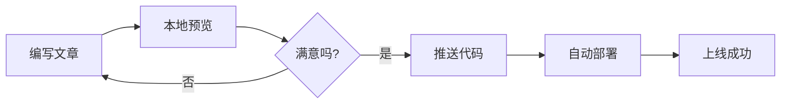
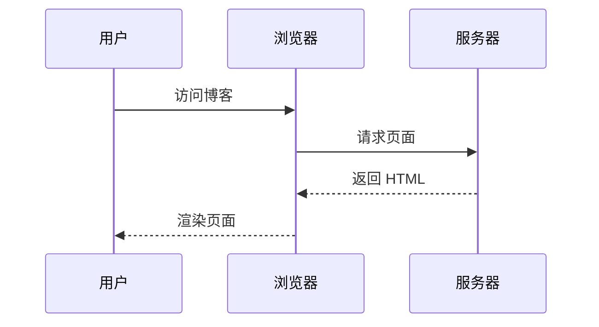
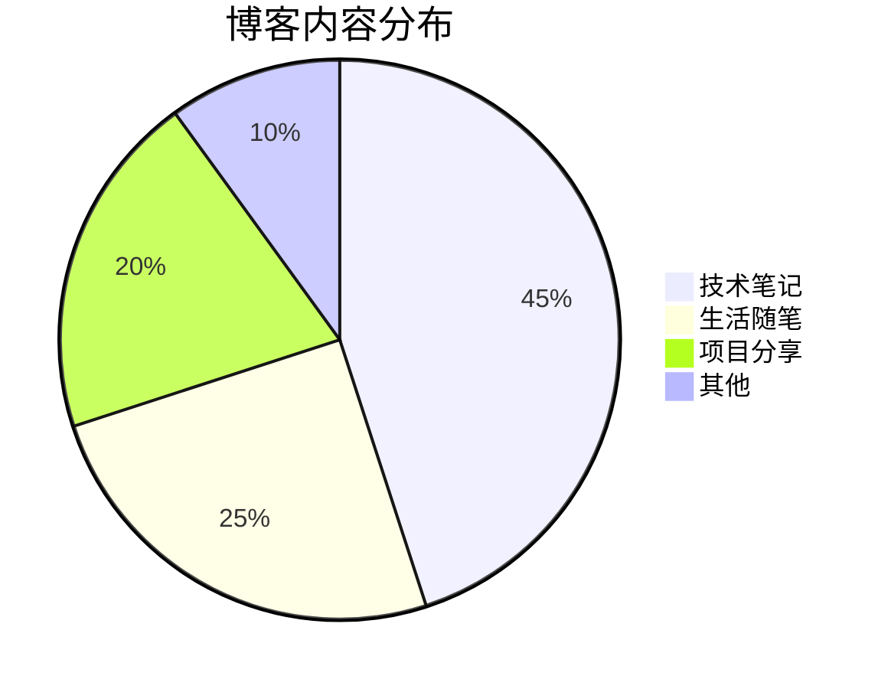

本文展示 astro-koharu 支持的所有 Markdown 增强功能。

## 链接嵌入功能

astro-koharu 支持自动嵌入独行链接，包括 Tweet 和通用链接预览。

### Tweet 嵌入测试

下面是一条独行的 Twitter 链接，应该自动转换为 Tweet 组件：

https://twitter.com/vercel_dev/status/1997059920936775706

这是普通段落中的链接 [Vercel Tweet](https://twitter.com/vercel_dev/status/1997059920936775706)，不应该被嵌入。

使用新域名 x.com 的 Tweet：

https://x.com/vercel_dev/status/1997059920936775706

### 通用链接预览测试

这是段落中的链接 [react-tweet](https://github.com/vercel/react-tweet)，不应该被嵌入。

下面是一个独行的普通链接，应该显示 OG 预览卡片：

https://github.com/vercel/react-tweet

这是没有 OG 图的链接

https://react-tweet.vercel.app/

这是获取不到 OG 信息的链接

https://zhuanlan.zhihu.com/p/1900483903984243480

### Codepen 链接嵌入

https://codepen.io/botteu/pen/YPKBrJX/

### 链接嵌入规则

- 独行的 Twitter/X 链接自动转换为 Tweet 组件
- 独行的其他链接显示 OG 预览卡片
- 段落内的链接保持原样
- 支持深色/浅色主题切换

## 代码高亮

支持多种编程语言的语法高亮，并自动跟随主题切换。

### JavaScript

```javascript
function greet(name) {
  console.log(`Hello, ${name}!`);
  return {
    message: "Welcome to astro-koharu",
    timestamp: Date.now(),
  };
}

greet("World");
```

### TypeScript

```typescript
interface BlogPost {
  title: string;
  date: Date;
  tags: string[];
  content: string;
}

const post: BlogPost = {
  title: "My First Post",
  date: new Date(),
  tags: ["astro", "blog"],
  content: "Hello World!",
};
```

### Python

```python
def fibonacci(n: int) -> list[int]:
    """Generate Fibonacci sequence"""
    if n <= 0:
        return []
    elif n == 1:
        return [0]

    fib = [0, 1]
    for i in range(2, n):
        fib.append(fib[i-1] + fib[i-2])
    return fib

print(fibonacci(10))
```

### Bash

```bash
#!/bin/bash
# Start development server
pnpm install
pnpm dev

echo "Server is running at http://localhost:4321"
```

## GFM 表格

| 功能     | 支持状态 |         说明 |
| :------- | :------: | -----------: |
| 表格     |    ✅    |     支持对齐 |
| 任务列表 |    ✅    |       复选框 |
| 删除线   |    ✅    | ~~删除文本~~ |
| 自动链接 |    ✅    | 自动识别 URL |

## 任务列表

- [x] 安装 astro-koharu
- [x] 配置站点信息
- [ ] 写第一篇文章
- [ ] 部署到 Vercel

## Mermaid 图表

### 流程图



### 时序图



### 饼图



## 文本样式

- **粗体文本**
- _斜体文本_
- ~~删除线~~
- `行内代码`
- [链接文本](https://github.com/cosZone/astro-koharu)

## 引用

> 这是一段引用文本。
>
> astro-koharu 让博客搭建变得简单而优雅。

## 标题层级

本文展示了 h2-h6 各级标题，它们都会自动生成锚点链接，方便分享和引用。

### 三级标题

#### 四级标题

##### 五级标题

###### 六级标题

## 分割线

---

## 列表

### 无序列表

- 项目一
  - 子项目 A
  - 子项目 B
- 项目二
- 项目三

### 有序列表

1. 第一步
2. 第二步
   1. 子步骤 A
   2. 子步骤 B
      1. 子步骤 C
3. 第三步

## 图片

图片会自动应用 LQIP（低质量图片占位符）效果：


## Shoka 兼容 Markdown 语法

除了上述标准 Markdown 增强外，astro-koharu 还支持从 Hexo Shoka 主题迁移的丰富扩展语法，包括：

- **文字特效** — 下划线 ++ins++、高亮 ==mark==、上下标 ~sub~ / ^sup^、颜色文字
- **隐藏文字** — Spoiler 粒子动画 !!隐藏文字!! 和 !!模糊效果!!{.blur}
- **注音标注** — Ruby {漢字^かんじ}
- **容器块** — 提醒块 `:::info`、折叠块 `+++primary 标题`、标签卡 `;;;tab`
- **友链卡片** — `` YAML 数据渲染为交互卡片
- **音视频播放器** — `` 支持网易云/QQ 音乐歌单
- **数学公式** — KaTeX 行内 $E=mc^2$ 和块级 `$$...$$`
- **代码块增强** — title、mark 行高亮、command 提示符
- **练习题系统** — 单选、多选、判断、填空四种题型
- **加密内容块** — `:::encrypted{password="..."}` AES-256-GCM 加密，防止爬虫收录

所有功能均可在 `config/site.yaml` 中独立开关。完整语法演示和用法请参阅 [Shoka 主题 Markdown 语法演示](/post/note/shoka-features)。

## 加密内容块

使用 `:::encrypted{password="密码"}` 语法创建加密区块。内容在构建时使用 AES-256-GCM 真正加密，密码不会出现在最终 HTML 中，有效防止搜索引擎和爬虫收录敏感内容。

加密块内的 Markdown 会获得与普通内容完全相同的渲染处理（Shiki 代码高亮、KaTeX 公式等），解密后直接展示。

> 前端无法实现真正意义上的加密，因为密码需在客户端输入，密文和算法对用户可见，安全性完全取决于密码强度。本功能的目的是**防止搜索引擎和爬虫直接收录明文内容**，而非对抗有针对性的破解。

````markdown
:::encrypted{password="demo"}
这段内容已加密，输入密码 `demo` 即可查看。

支持 **完整 Markdown 语法**，包括代码块：

```python
print("Hello from encrypted block!")
```

:::
````

:::encrypted{password="demo"}
这段内容已加密，输入密码 `demo` 即可查看。

支持 **完整 Markdown 语法**，包括代码块：

```python
print("Hello from encrypted block!")
```

:::

## 总结

以上展示了 astro-koharu 支持的主要 Markdown 功能。更多功能请参考 [使用指南](/post/astro-koharu-guide)。
